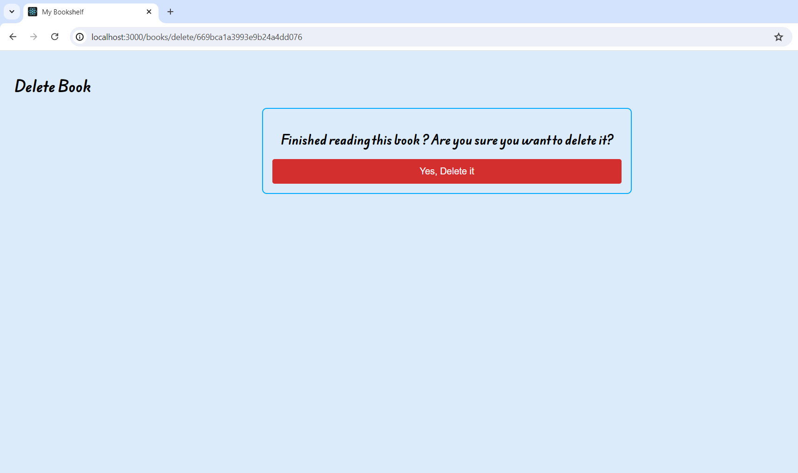

This project is a MERN based full stack web app that you can use to save your books and virtually bookmark the pages from where you stopped reading the last time !  
The project uses nodejs and express for route management and backend server. 
All your saved books are stored using the MongoDB database. 
The frontend is created using the React framework. 
You have just got a virtual way to manage your book collection! 

